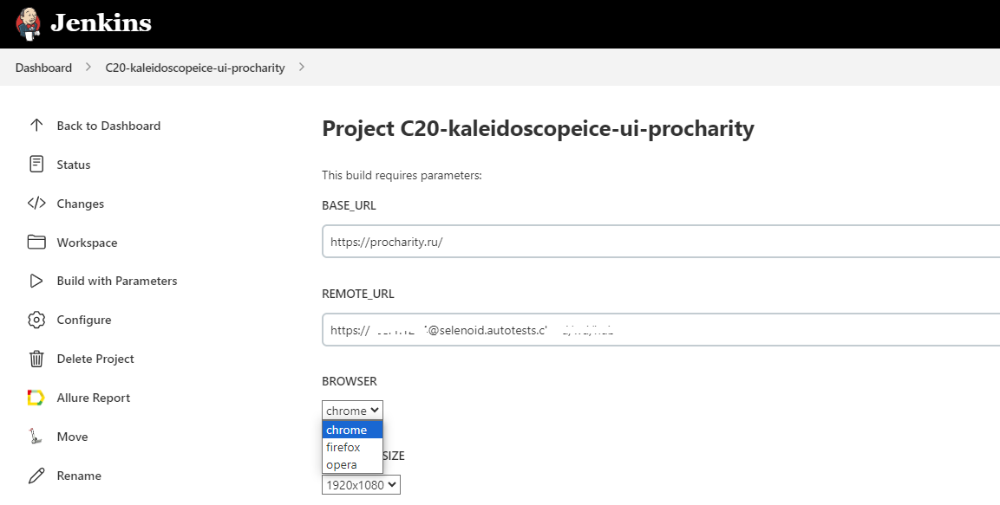

# Проект по тестированию элементов сайта procharity.ru

## Оглавление

- <a href="#tools">Использованный стек технологий</a>
- <a href="#list">Доступные проверки</a>
- <a href="#jenkins">Параметризованные тесты в Jenkins</a>
- <a href="#allure">Результаты запуска тестов в Allure Report</a>
- <a href="#vid">Видео одной из проверок</a>

## :heavy_check_mark: Доступные проверки

- Проверки работы ссылок меню навигации
- Проверки полей формы регистрации для компаний

## </a> Задача в <a target="_blank" href="https://jenkins.autotests.cloud/">Jenkins</a>

 
 

> интеграция с Jenkins позволяет сделать тест параметризованным

## </a> Отчет в <a target="_blank" href="https://allure.autotests.cloud/">Allure Report</a>

> Отчет позволяет увидеть результаты выполнения тестов по отдельности

> Отчет включает в себя скриншот перед закрытием, видео, pagesource

  

> Видео к прохождению теста "При длине телефона 9 символов кнопка Зарегистрироваться неактивна" на Selenoid
 